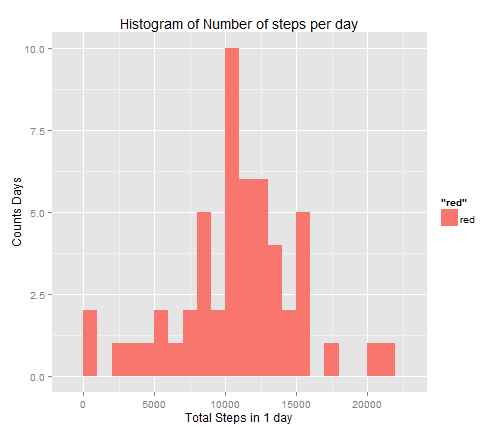

Reproducible Research - Peer Assessment 1
========================================================

##Introduction

##Set environment for script

This markdown document assumes that
1.The base working folder is C:/Users/james_000/DataScPrj/RepResearch/Assign1/RepData_PeerAssessment1
2.The data is held in a sub-folder called .\data and is called activity.csv


```r
##load Libs
library("plyr")
library("knitr")
library("ggplot2")
library("xtable")
##set workign directory
setwd("C:/Users/james_000/DataScPrj/RepResearch/Assign1/RepData_PeerAssessment1")
```

##Load Data

This is text to explain how the data was sourced and loaded


```r
actdata <- read.csv("./data/activity.csv")
actdata$date <- as.POSIXct(actdata$date)
```

##Question 1

Here was are creating a histogram of the number of steps in a given day and calculating the mean and median number of steps and then displayign them in the output document


```r
##question 1
## create summary data frame by date
stepsbyday <- ddply(actdata[!is.na(actdata$steps),],.(date), 
           summarize,totsteps=sum(steps))

##histogram plot
p1 <- ggplot(stepsbyday,aes(totsteps, fill="red"))
p1 <- p1 +labs(title="Histogram of Number of steps per day", y="Counts Days", x= "Total Steps in 1 day")
p1 <- p1 + geom_histogram(binwidth=1000)
p1
```

 

```r
stepmean <- mean(stepsbyday$totsteps)
stepmedian <- median(stepsbyday$totsteps)
rowname <- c("Mean","Median")
Values <- c(stepmean,stepmedian)
xtab1 <-xtable(as.data.frame(x=Values, row.names=rowname ) )                        
```

##Summary Statistics for number of steps per day

```r
print(xtab1, type="html")
```

<!-- html table generated in R 3.0.3 by xtable 1.7-3 package -->
<!-- Wed Jun 11 17:07:50 2014 -->
<TABLE border=1>
<TR> <TH>  </TH> <TH> Values </TH>  </TR>
  <TR> <TD align="right"> Mean </TD> <TD align="right"> 10766.19 </TD> </TR>
  <TR> <TD align="right"> Median </TD> <TD align="right"> 10765.00 </TD> </TR>
   </TABLE>

------ END OF DOCUMENT -------

